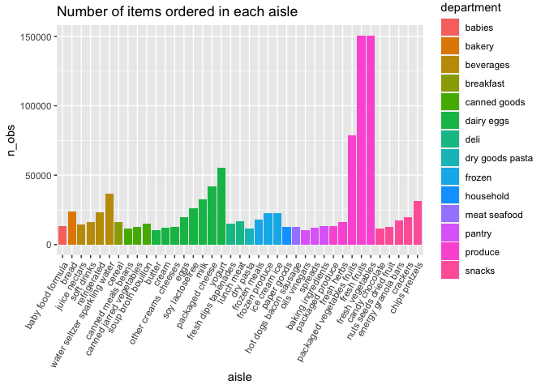

P8015_Hw3_agd2159
================
Zander De Jesus
10-14-2023

# Problem 1: Instacart Grocery Large-Scale Data Analysis and Plotting

Begin by loading important libraries, organizing markdown, and beginning
to pull in full dataset for exploratory data analysis.

``` r
library(tidyverse)
```

    ## ── Attaching core tidyverse packages ──────────────────────── tidyverse 2.0.0 ──
    ## ✔ dplyr     1.1.3     ✔ readr     2.1.4
    ## ✔ forcats   1.0.0     ✔ stringr   1.5.0
    ## ✔ ggplot2   3.4.3     ✔ tibble    3.2.1
    ## ✔ lubridate 1.9.2     ✔ tidyr     1.3.0
    ## ✔ purrr     1.0.2     
    ## ── Conflicts ────────────────────────────────────────── tidyverse_conflicts() ──
    ## ✖ dplyr::filter() masks stats::filter()
    ## ✖ dplyr::lag()    masks stats::lag()
    ## ℹ Use the conflicted package (<http://conflicted.r-lib.org/>) to force all conflicts to become errors

``` r
library(ggridges)
library(patchwork)
library(p8105.datasets)

data("instacart")

summary(instacart)
```

    ##     order_id         product_id    add_to_cart_order   reordered     
    ##  Min.   :      1   Min.   :    1   Min.   : 1.000    Min.   :0.0000  
    ##  1st Qu.: 843370   1st Qu.:13380   1st Qu.: 3.000    1st Qu.:0.0000  
    ##  Median :1701880   Median :25298   Median : 7.000    Median :1.0000  
    ##  Mean   :1706298   Mean   :25556   Mean   : 8.758    Mean   :0.5986  
    ##  3rd Qu.:2568023   3rd Qu.:37940   3rd Qu.:12.000    3rd Qu.:1.0000  
    ##  Max.   :3421070   Max.   :49688   Max.   :80.000    Max.   :1.0000  
    ##     user_id         eval_set          order_number      order_dow    
    ##  Min.   :     1   Length:1384617     Min.   :  4.00   Min.   :0.000  
    ##  1st Qu.: 51732   Class :character   1st Qu.:  6.00   1st Qu.:1.000  
    ##  Median :102933   Mode  :character   Median : 11.00   Median :3.000  
    ##  Mean   :103113                      Mean   : 17.09   Mean   :2.701  
    ##  3rd Qu.:154959                      3rd Qu.: 21.00   3rd Qu.:5.000  
    ##  Max.   :206209                      Max.   :100.00   Max.   :6.000  
    ##  order_hour_of_day days_since_prior_order product_name          aisle_id    
    ##  Min.   : 0.00     Min.   : 0.00          Length:1384617     Min.   :  1.0  
    ##  1st Qu.:10.00     1st Qu.: 7.00          Class :character   1st Qu.: 31.0  
    ##  Median :14.00     Median :15.00          Mode  :character   Median : 83.0  
    ##  Mean   :13.58     Mean   :17.07                             Mean   : 71.3  
    ##  3rd Qu.:17.00     3rd Qu.:30.00                             3rd Qu.:107.0  
    ##  Max.   :23.00     Max.   :30.00                             Max.   :134.0  
    ##  department_id      aisle            department       
    ##  Min.   : 1.00   Length:1384617     Length:1384617    
    ##  1st Qu.: 4.00   Class :character   Class :character  
    ##  Median : 8.00   Mode  :character   Mode  :character  
    ##  Mean   : 9.84                                        
    ##  3rd Qu.:16.00                                        
    ##  Max.   :21.00

``` r
nrow(instacart)
```

    ## [1] 1384617

``` r
ncol(instacart)
```

    ## [1] 15

This is a large dataset that contains 1384617 rows of observations and
15 column variables. Each row is a specific instacart product - with
associated department and aisle information. There are also categorical
variables that describe the time and day of the order, and number of day
since the previous order.

In total, there are 39123 products found in 131209 orders from 131209
distinct users.

### Task 1 - How many aisles are there, and which aisles are the most items ordered from?\*\*

``` r
num = instacart |> 
  distinct(aisle_id) |> 
  max()

aisles_df = instacart |> 
  janitor::clean_names() |> 
  group_by(department, aisle) |> 
  summarize(n_obs = n()) |> 
  arrange(desc(n_obs))
```

    ## `summarise()` has grouped output by 'department'. You can override using the
    ## `.groups` argument.

``` r
aisles_df
```

    ## # A tibble: 134 × 3
    ## # Groups:   department [21]
    ##    department aisle                          n_obs
    ##    <chr>      <chr>                          <int>
    ##  1 produce    fresh vegetables              150609
    ##  2 produce    fresh fruits                  150473
    ##  3 produce    packaged vegetables fruits     78493
    ##  4 dairy eggs yogurt                         55240
    ##  5 dairy eggs packaged cheese                41699
    ##  6 beverages  water seltzer sparkling water  36617
    ##  7 dairy eggs milk                           32644
    ##  8 snacks     chips pretzels                 31269
    ##  9 dairy eggs soy lactosefree                26240
    ## 10 bakery     bread                          23635
    ## # ℹ 124 more rows

There are **134 distinct aisles** across all the products instacart
offers. After creating a separate grouped tibble based on aisle name and
the bulk total of orders from each aisle, we can see that the the top 3
aisles with the highest amount of items ordered are **Fresh Vegetables,
Fresh Fruits, and Packaged Vegetables / Fruits.** These are then
followed by Yogurt and Packaged Cheese in the dairy department.

### Task 2 - Plotting Number of Items sold in Highest Demand Aisles\*\*

``` r
aisles_df |> 
  filter(n_obs >= 10000) |> 
  mutate(aisle = fct_reorder(aisle, n_obs)) |> 
  ggplot(aes(x=aisle, y = n_obs, fill = department)) + 
  geom_col() +
  labs(title = "Number of items ordered in each aisle") +
  theme(axis.text.x = element_text(angle= 60, hjust = 1))
```

<!-- -->
This column graph visualizes the relative quantities of items ordered
across each aisle, color-coded by associated department. Internal to
each department, the aisles are organized from least in demeand to most
in demand items.

### Task 3 - Identifying Most Popular Items in Specific Aisles\*\*

``` r
popular_items = instacart |> 
  janitor::clean_names() |> 
  filter(aisle == "baking ingredients" | aisle == "dog food care" | aisle == "packaged vegetables fruits") |> 
  group_by(aisle, product_name) |> 
  summarize(n_obs = n()) |> 
  arrange(desc(n_obs)) |> 
  mutate(item_rank = min_rank(desc(n_obs))) |> 
  filter(item_rank < 4)
```

    ## `summarise()` has grouped output by 'aisle'. You can override using the
    ## `.groups` argument.

``` r
popular_items |> 
    knitr::kable(digits = 2)
```

| aisle                      | product_name                                  | n_obs | item_rank |
|:---------------------------|:----------------------------------------------|------:|----------:|
| packaged vegetables fruits | Organic Baby Spinach                          |  9784 |         1 |
| packaged vegetables fruits | Organic Raspberries                           |  5546 |         2 |
| packaged vegetables fruits | Organic Blueberries                           |  4966 |         3 |
| baking ingredients         | Light Brown Sugar                             |   499 |         1 |
| baking ingredients         | Pure Baking Soda                              |   387 |         2 |
| baking ingredients         | Cane Sugar                                    |   336 |         3 |
| dog food care              | Snack Sticks Chicken & Rice Recipe Dog Treats |    30 |         1 |
| dog food care              | Organix Chicken & Brown Rice Recipe           |    28 |         2 |
| dog food care              | Small Dog Biscuits                            |    26 |         3 |

This table above provides the top three most popular items in the
requested aisles `baking ingredients`, `dog food care`, and
`packaged vegetables fruits`. Because of the relative demand for produce
across all orders, the packaged vegetable fruit orders are all much
higher than the other two aisles of interest.

### Task 4 - Looking at weekly orders of two products

``` r
Apple_Coffee = instacart |> 
  select(product_name, order_dow, order_hour_of_day) |> 
  group_by(product_name, order_dow) |> 
  filter(product_name == "Pink Lady Apples" | product_name == "Coffee Ice Cream") |> 
  mutate(
    order_dow = recode(
      order_dow,
      "0" = "Sunday",
      "1" = "Monday",
      "2" = "Tuesday",
      "3" = "Wednesday",
      "4" = "Thursday",
      "5" = "Friday",
      "6" = "Saturday")) |> 
  summarize(avg_hr = mean(order_hour_of_day)) |> 
  pivot_wider(
    names_from = order_dow,
    values_from = avg_hr)
```

    ## `summarise()` has grouped output by 'product_name'. You can override using the
    ## `.groups` argument.

``` r
Apple_Coffee |> 
    knitr::kable(digits = 2)
```

| product_name     | Friday | Monday | Saturday | Sunday | Thursday | Tuesday | Wednesday |
|:-----------------|-------:|-------:|---------:|-------:|---------:|--------:|----------:|
| Coffee Ice Cream |  12.26 |  14.32 |    13.83 |  13.77 |    15.22 |   15.38 |     15.32 |
| Pink Lady Apples |  12.78 |  11.36 |    11.94 |  13.44 |    11.55 |   11.70 |     14.25 |

This final part of Problem 1 asks us to narrow the dataset down to just
two procucts - Pink Lady Apples and Coffee Ice Cream, and look at there
average times across the week. General trends show that during the work
week, Apples are usually ordered earlier for lunch or snack while ice
cream is ordered on average after work in the evening. Meanwhlile on the
weekend Fri through Saturday, Ice cream and Apples have similar order
times, being bought in the mid afternoon 12 to 1 pm for each product.

# Problem 2: Behavioral Risk Factors Dataset Analysis

Beginning by importing the dataset and doing initial steps to clean the
tibble dataframe. \### Task 1: Initial Data Cleaning

``` r
data("brfss_smart2010")

brfss_clean = brfss_smart2010 |> 
  janitor::clean_names() |> 
  select(everything(), -data_value_unit, -data_value_footnote, -data_value_footnote_symbol, -location_id) |> 
  rename(state = locationabbr, county = locationdesc) |> 
  filter(topic == "Overall Health")

#Specific code to reorder response factor levels
brfss_clean = brfss_clean |> 
  mutate(response = as.factor(response)) |> 
  mutate(response = ordered(response, c("Poor", "Fair", "Good", "Very good", "Excellent")))
```

The original dataset before cleaning has 134203 rows of content,
indicating a different question category from each state location, and
23 column variables. 3 of these columns were entirely empty with NA’s
and were removed in the tidy dataset `brfss_clean`. Also one column
`data_value_unit` was only describing that the unit was in percentages,
and was removed to avoid confusion in calculations.

For clarity, locationabbr and locationdesc were renamed to state and
county respectively. After filtering only the Overall Health topic
questions, and removign the extraneous columns identified above, this
cleaned dataframe has 10625 rows and 19 column variables.

The `response` column was converted from character to factor format,
with five levels ordered from Poor -\> Excellent as requested.

### Task 2: Analyzing Specific Response Data by Years

*Q: In 2002, which states were observed at 7 or more locations? What
about in 2010?*

To do this, we will make two filtered subdataframes for both 2002 and
2010, that make tables containing 7 or more county locations for each
state. This will use the `group_by` function.

``` r
largestates_2002 = brfss_clean |> 
  filter(year == 2002) |> 
  group_by(year, state) |> 
  summarize(n_locations = (n()/5)) |> 
  filter(n_locations >= 7) |> 
  arrange(desc(n_locations))
```

    ## `summarise()` has grouped output by 'year'. You can override using the
    ## `.groups` argument.

``` r
largestates_2002 |> 
  knitr::kable(digits = 2)
```

| year | state | n_locations |
|-----:|:------|------------:|
| 2002 | PA    |          10 |
| 2002 | MA    |           8 |
| 2002 | NJ    |           8 |
| 2002 | CT    |           7 |
| 2002 | FL    |           7 |
| 2002 | NC    |           7 |

Because each distinct county will have the 5 levels of the response
column for 1 entry, a state with 7 or more county locations can be
identified by having 35 or more response entry levels.

In 2002, Six states - **Connecticut, Florida, Massachusetts, North
Carolina, New Jersey, and Pennsylvania** - had responses coming from 7
or more distinct county locations. Pennsylvania had the highest capacity
at 10 different locations (50/5 responses per location).

Below does the same exploratory data organization for the year 2010:

``` r
largestates_2010 = brfss_clean |> 
  filter(year == 2010) |> 
  group_by(year, state) |> 
  summarize(n_locations = (n()/5)) |> 
  filter(n_locations >= 7) |> 
  arrange(desc(n_locations))
```

    ## `summarise()` has grouped output by 'year'. You can override using the
    ## `.groups` argument.

``` r
largestates_2010 |> 
  knitr::kable(digits = 2)
```

| year | state | n_locations |
|-----:|:------|------------:|
| 2010 | FL    |          41 |
| 2010 | NJ    |          19 |
| 2010 | TX    |          16 |
| 2010 | CA    |          12 |
| 2010 | MD    |          12 |
| 2010 | NC    |          12 |
| 2010 | NE    |          10 |
| 2010 | WA    |          10 |
| 2010 | MA    |           9 |
| 2010 | NY    |           9 |
| 2010 | OH    |           8 |
| 2010 | CO    |           7 |
| 2010 | PA    |           7 |
| 2010 | SC    |           7 |

By 2010, we can see that **14 different states** have 7 or more distinct
county locations covered by the response survey to Overall Health. The
state with the most county representation in this year was Florida, with
41 distinct county locations reporting responses (205/5 response levels
per location).

### Task 3
